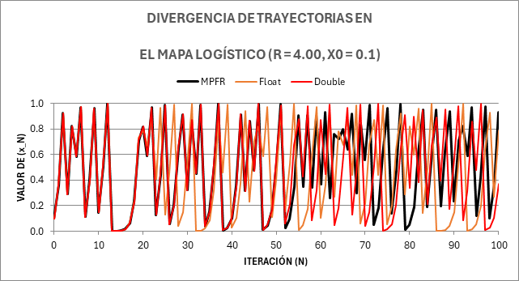
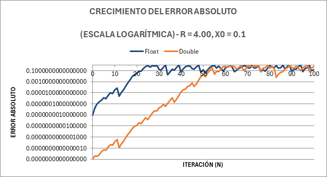

# Análisis de Precisión en las Trayectorias del Mapa Logístico

Este repositorio contiene la implementación en C++ y el análisis de datos empíricos para cuantificar la pérdida de precisión en la simulación del mapa logístico bajo un régimen de caos determinista.

Se estudia el comportamiento del mapa logístico, definido por la ecuación:

$$x_{n+1}=rx_n(1-x_n)$$

El objetivo central es contrastar la divergencia geométrica de las implementaciones estándar en coma flotante (estándar IEEE 754) frente a un control estricto de precisión arbitraria.

## Mecánica Experimental

Para garantizar que la pérdida de información observada sea un rasgo universal del caos computacional y no un artefacto estadístico aislado, la simulación se ejecuta iterando un diseño experimental de **35 escenarios independientes**. 

Se calcularon 1000 iteraciones variando:
* **Tasa de crecimiento (r):** 3.90, 3.92, 3.95, 3.98, 4.00
* **Condición inicial (x0):** 0.1, 0.2, 0.3, 0.4, 0.5, 0.6, 0.7

## Evidencia Visual (`/img`)

El directorio `img/` consolida el registro gráfico de las primeras 100 iteraciones para los 35 escenarios. Las representaciones visuales demuestran la iteración crítica de ruptura topológica.

### Divergencia de Trayectorias
La gráfica de divergencia ilustra el punto exacto en el que la aproximación de la máquina destruye la predicción matemática real.


### Crecimiento del Error Absoluto
Cuantificación en escala logarítmica (base 10) de la amplificación del error de redondeo inducido por la limitación de bits.


## Resultados Clave

El procesamiento consolidado de los 35 escenarios demostró empíricamente el "Efecto Mariposa" subyacente en la arquitectura de datos:
1.  **Precisión Simple (float 32-bit):** Independientemente de la configuración inicial, la trayectoria diverge totalmente del modelo matemático real cerca de la iteración 23, provocado por la saturación de sus 24 bits efectivos de mantisa.
2.  **Precisión Doble (double 64-bit):** Su mantisa de 53 bits retrasa la corrupción de datos, pero colapsa irremediablemente cerca de la iteración 52.
3.  **Comportamiento del Error:** La propagación del ruido algorítmico mantiene una tasa de amplificación exponencial en todos los vectores probados.

## Estructura de Archivos
* `simulation/`: Algoritmos en C++ para la generación de trayectorias (Float, Double, MPFR).
* `analisis_error.cpp`: Script encargado de procesar los registros simultáneos, calcular diferencias absolutas y relativas.
* `results/`: Dataset consolidado en formato CSV con los registros analíticos iteración por iteración.
* `img/`: Gráficas resultantes de divergencia y propagación de error.

## Stack Tecnológico y Dependencias
* **Lenguaje:** C++ (Estándar C++17/20)
* **Entorno:** MinGW, CMake
* **Bibliotecas:** GNU MPFR y GMP (enlazadas estáticamente para redondeo matemáticamente correcto)
* **Procesamiento de datos:** Macros VBA (Excel)

## Instalación del Entorno

El proyecto requiere las librerías MPFR y GMP. La forma más robusta de configurarlas en Windows para compilación C++ es mediante MSYS2:

1. Descarga e instala [MSYS2](https://www.msys2.org/).
2. Abre la terminal de MSYS2 UCRT64 y ejecuta los siguientes comandos para instalar el compilador y las librerías matemáticas:
   ```bash
   pacman -S mingw-w64-ucrt-x86_64-gcc
   pacman -S mingw-w64-ucrt-x86_64-cmake
   pacman -S mingw-w64-ucrt-x86_64-mpfr
   pacman -S mingw-w64-ucrt-x86_64-gmp
